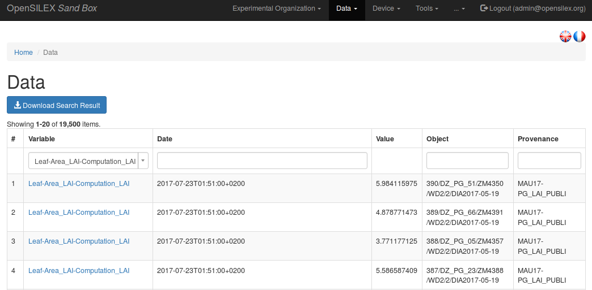
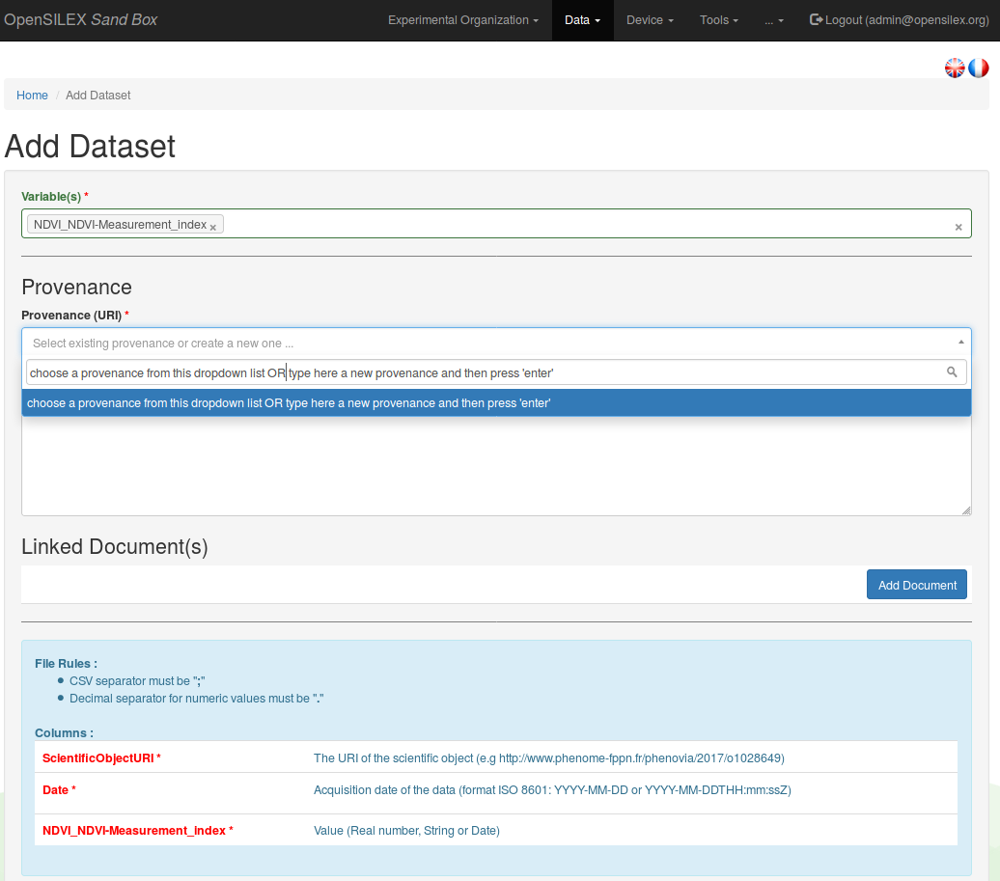
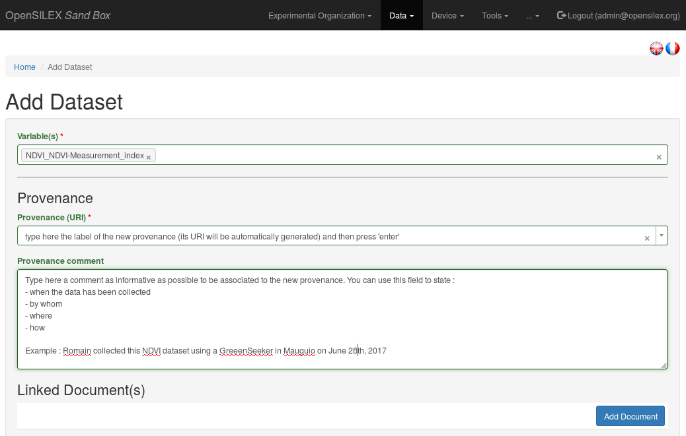
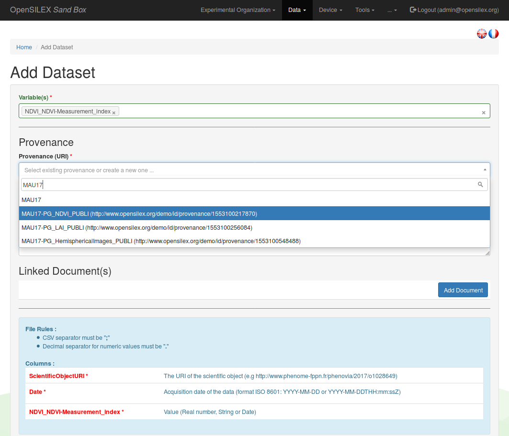
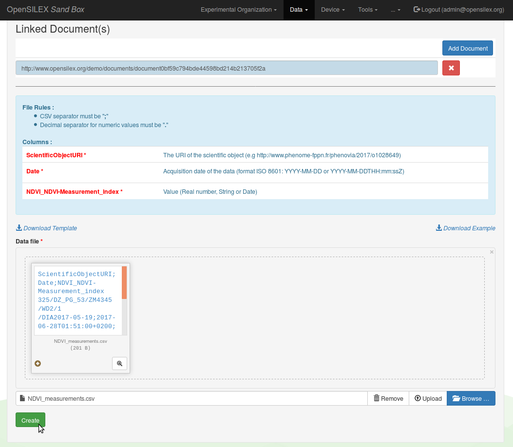

# Data

## View data

Ypu can view and download both environmental an phenotypic variables values from the `View` section of the `Data` menu.

Select a variable from the dropdown list at the top left corner of the table to get an overview of the data linked to this variable.

You can refine your search by using the **Date**, **Object** or **Provenance** filters at the top of the table displaying the data associated to the selected variable.
In order to validate your search, press enter or click anywhere outside the filter insert after having typed the content of your search.

## Add data

### Overview of a dataset import

One can use the web app to manually insert data in Phis, although it is recommended to have this task covered by an automated pipeline, such as a Python scripts which inserts automatically data produced by a sensor to Phis using the `POST /data` web service.

When inserting data in Phis through the webapp, one must provide :

- the name of the **variable(s)** concerned by the data import
- the source (**provenance**) of this dataset
- the dataset itself (as a **CSV file** in which fields are separated by semi-colons `;`, and the decimal separator is a point `.`)

Optionnaly, one can also link one or more documents to the dataset provenance (e.g. files describing the data collection method, the drone path files, etc.).

### Link an imported dataset to its provenance

It is mandatory to link every dataset import in Phis to a **provenance**, i.e. an identified data source which is characterized by a URI, a label and a short description (its comment).

One can either choose from an existing provenance from the **Provenance (URI)** dropdown list, either type in this **Provenance (URI)** text insert the label of a new provenance, which has to be described in the following text insert, the **Provenance comment** field.
The provenance comment is a free text text insert, it is however suggested to be as precise as possible regarding the description of the dataset source.
One can use the provenance comment to answer to some of the following questions :

- where has the data been collected ?
- when has the data been collected ?
- by whom has the data been collected ? (e.g. the operator supervising the data collection or the equipment linked to it)
- how has the data been collected ? (e.g. the method from the variable description and the equipment used)
- for which purpose has the dtat been collected ? (e.g. the name of a project)

The same provenance (and its URI) can be used for several datasets, as long as they have the same source.

When selecting an existing provenance instead of creating a new one, it is only needed to select the desired provenance label from the dropdown list of the **Provenance (URI)** list.
It is possible to start typing the label of the looked for provenance in order to search through the existing provenances, in doing so reducing the dropdown list length.

As stated above, one can also (but it is not mandatory) link one or several documents to the dataset provenance (e.g. files describing the data collection method, the drone path, computation scripts or user manuals supplied by the manufacturer of the equipment used for the data collection).

### Finalize a dataset import

A file template is created using the variable(s) name(s) provided by the user at the first step of this `Data / Add` form.
This template file header contains :

- the concerned **ScientificObjectURI** in the first column
- the data collection **Date** in the second column
- the **variables** labels in the following columns

 To finalize the data import process, one has to upload a **CSV file** containing the data, which header matches the one of the template file, in which fields are separated by semi-colons `;`, and in which the decimal separator is a point `.`

