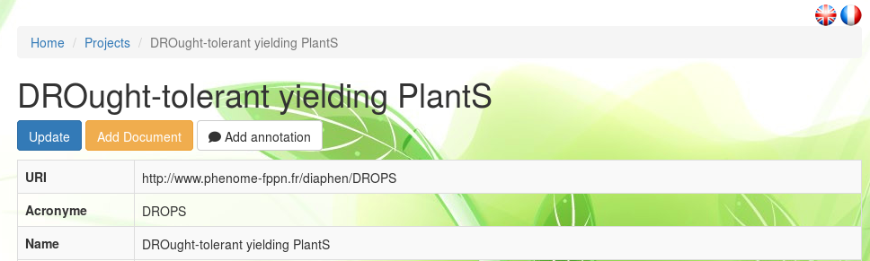
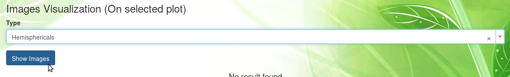
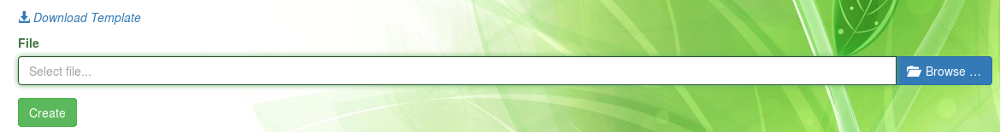
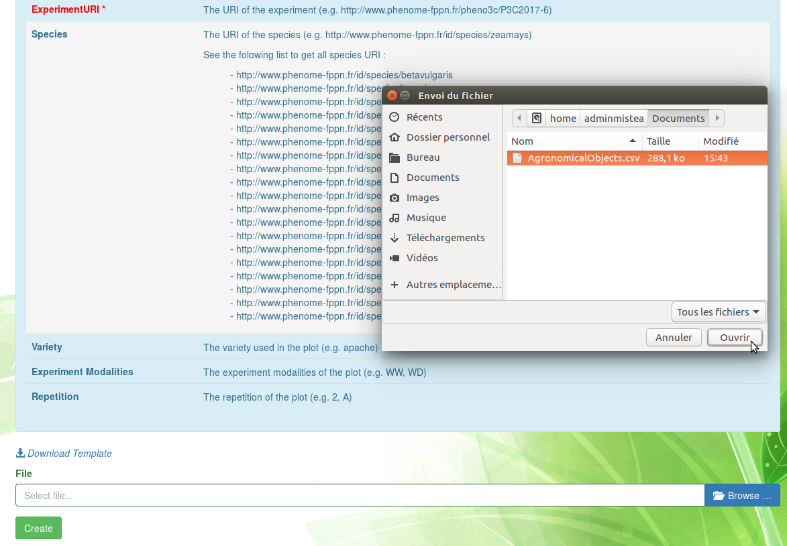
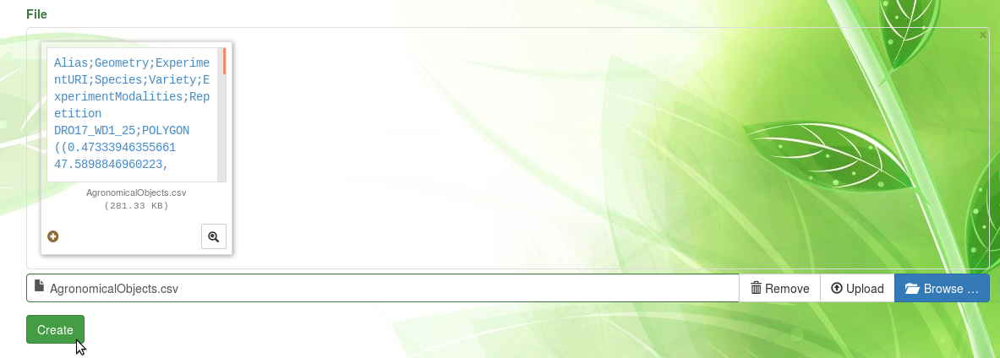
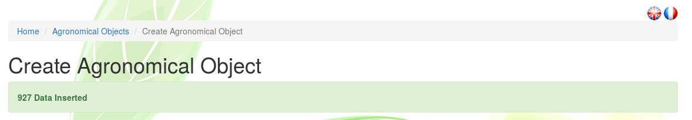
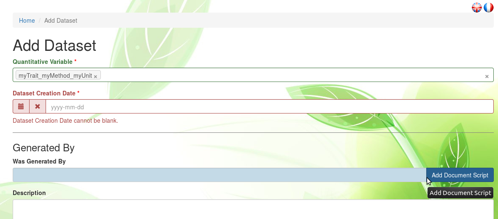
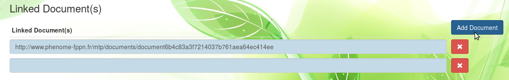
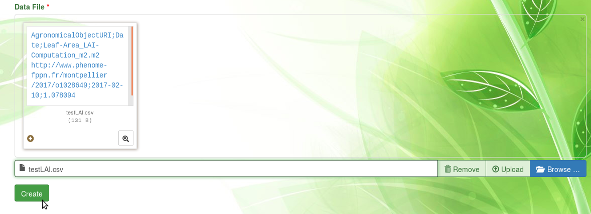

# Experimental Organization

## Infrastructures

Scientific experiments generate data, which is the focus the present information system.
However, if only the data produced by experiments is stored, and not the complete experimental conditions, i.e. the environmental conditions, infrastructure and supporting equipment or resources used to conduct those experiments, then such archived data would be orphan and therefore non reusable.

The first element of experimental conditions which is stored in Phis is the infrastructures linked to plant phenotyping experiments.
An infrastructure can be a national infrastructure, a local infrastructure, or an installation (also refered to as "platform" or "facility"), as defined at [emphasis.plant-phenotyping.eu](https://emphasis.plant-phenotyping.eu/Infrastructure_ontology) and at [agroportal.lirmm.fr/ontologies/OEPO](http://agroportal.lirmm.fr/ontologies/OEPO/?p=classes&conceptid=http%3A%2F%2Fwww.phenome-fppn.fr%2Fvocabulary%2F2018%2Foepo%23Infrastructure).

Users register infrastructures in Phis in order to later enrich metadata associated to experimental data by establishing a link between this data and given infrastructures.

The complete list of infrastructures registered in a Phis session is available in the `Experimental organization / Infrastructures` menu, accessible from Phis top navigation bar.

The <span class="btn btn-warning">Add document</span> button at the top of the infrastructures information sheet remains orange until a first document has been added, e.g. a flyer describing the infrastructure or an organization chart.
See the [Documents](../experimental-organization/#documents) section below for further information on documents.

## Projects

### What are projects ?
A research project is the higher level of organisation in Phis.
It is generally the object of a contract or a grant agreement between the laboratory performing the research activities and funding agencies providing the financial support.
A project can hold many experiments from various experimental campaigns.
Besides, several projects can participate to the same experimentation.

### What are project properties ?
Projects fact sheets are all public, i.e. visible for every Phis user, including those unrelated to them.
However, experimental data included in a project is also necessarily related to a given experiment.
This data is accessible only to users who belong to a group (either owner or guest) authorized to access the experimentation it is related to: access rights are managed by experiment and not by project.
Please see the [Restrictions to a group](../community/#restrictions-to-a-group) section of this documentation for further details on data access matters.

The complete list of projects is available in the `Experimental organization / Projects` menu, accessible from Phis top navigation bar.
The projects list is preceded by a research bar enabling the user to filter projects by their acronym, their main source of funding, and their start and end dates.
There's no need to use the same case as the expected results: a lowercase search returns every results matching the characters, disregarding whether those match are lowercase or uppercase.
Further information on a given project is available on its information sheet, accessed to from the projects list through the eye-icon on the right-hand side of this project row.


A project information sheet displays all this project information stored in Phis : URI, acronyme, objective, start and end dates, contacts linked to the project, a description, etc.
Documents (PDF, tables, etc.) can also be linked to a project.
At the top of the project information sheet lie three buttons allowing the user to interact with the selected project.



The project specifics, displayed in the information sheet, can be modified with the <span class="btn btn-primary">Update</span> button.

Another top button is the <span class="btn btn-warning">Add document</span> button which remains orange until a first document has been added.
See the [Documents](../experimental-organization/#documents) section below for further information on Phis documents and for learning how to insert them in the information system.

The <span class="btn btn-default">Add annotation</span> button can be used by any user in order to annotate the selected project using the [Web Annotation Data Model](https://www.w3.org/TR/annotation-model/) (oa).
See the [Annotation](../experimental-organization/#annotation) section below for further information on annotations within Phis.

### Create a project
Within the `Projects` menu, one can create a new project with the
<span class="btn btn-success">Create Project</span> button.

Tool tips are provided for most fields: they appear on the left hand side when one drags the pointer on those fields.


The mandatory fields, followed by a red asterisk, are:

- acronyme
- name
- date (start / end)

However, it is highly recommended to fill every field. If possible, fields requiring plain text (keywords, description) should be answered to in English.

`URI`. The project URI is automatically created using the acronym provided by the user.
The URI creation respects the [w3 recommandations](https://www.w3.org/TR/cooluris/).

`Acronym`. Short and meaningful, the acronym will be the preferred way to refer to the created project.
The acronym provided here is usually the one of the research project.
A project acronym cannot include spaces.
Once the project created, its acronym can no longer be modified.

`Name`. Full name of the project, it will seldom be refered to but allows a project creator to explicit the acronym. For instance, *RAPeSeed Oil content anD Yield under low Nitrogen input* would be an adequate name for the project whose acronym is *RAPSODYN*.

`Subproject Of`. If the new project is part of an existing project (requisitly known to Phis), one can select the name of the given mother-project within the exhaustive list of projects registered to the Phis instance where the new project is created.

`Subproject Type`. The subproject type can optionnaly be provided. It can be either an existing type to be selected from the list of proposed project types, either a new type provided by the user. In the later case, one has to type the new subproject type (e.g. *phd thesis* or *internship*) in the search field of **Subproject Type** and then click on the newly proposed type.


`Objective`. A short synthesis of the project objectives is to be provided in plain text, preferably in English. A more complete description will be asked in the **Description** field.

`Financial Support`. Organism, institution or funding agency providing the financial support of the research project. Only one organism supporting financially the project can be cited for now. Same as the **Subproject Type** field, the answer can be both from a predefined list or a new one (the user has to type the new organism name and then click on the search result matching the organism name).

`Financial Name`. As indicated in the tool tip, this field is meant for the user to provide the identification of the financial support document (e.g. a grant agreement number).

`Date Start` and `Date End` are to be provided in the format YYYY-MM-DD (year-month-day), directly or through the calendar view.
If the end date of the project is unknown, the start date can be used also as **Date End** temporarily.

`Scientific Contacts`. Email adresses of the scientists involved in the project.
The email adresses refer uniquely to persons existing on Phis.
If unavailable in the predefined list, emails can be added to Phis from the `Persons` menu, prior to the new project creation. Please see the [Persons](../community/#persons) section of this documentation for further details.

`Administrative Contacts`. Email adresses of the administrative personnel linked to the project (e.g. human ressources people).
The email adresses refer uniquely to persons existing on Phis.

`Project Coordinators`. Email adresses of the project coordinators.
The email adresses refer uniquely to persons existing on Phis.

`Website`. If available, URL of the website of the project.

`Keywords`. Keywords, preferably in English, characterizing the project. Each keyword should be separated by a comma and not include any capital letter, e.g. *drought, maize*.


`Description`. Complete plain text description of the project, preferably provided in English language. Additionally to the description, additional information can be provided as uploaded files, after the project has been created.

## Experiments

### What are experiments ?
Field plant phenotyping experimentations are refered to in Phis as **Experiments**.
Experiments in Phis form self-sustained organizational units occuring in a delimited and known time frame.
Every agronomical objects and environmental data stored in Phis field have to be related to an experiment.
Experiments include both raw and cleaned data.
The data types found in Phis experiments are including but not limited to :

- phenotypic data
- environmental data
- analysis, workflows and their associated results
- documents giving a deeper understanding of the experiments

### What are experiment properties ?
Contrary to projects, experiments information sheets are not public, but accessible only to the Phis members which are part of the groups involved in these experiments.
Please go to [Access rights](../community/#access-rights) for further details on this matter.

From the `Experiments` menu, a Phis user has access to the list of experiments it has the rights to access to.
Every experiment on this list is characterized by :

- its **URI** which identies it uniquely
- its **Alias**, a short internal denomination
- its stat and end dates
- the experimental installation in which is has been performed
- the campaign it is part of, i.e. the year

From **Home / Experiments**, one can click on the eye icon on the right to see a given experiment information sheet.


Further information on the experiment is provided on its information sheet, such as the groups of users that have been given access to the experiment's data.
For more detail on experimental data access restrictions, see the section [Restrictions to a group](../community/#restrictions-to-a-group).


On top of the experiment information sheet, several buttons are displayed.
The buttons <span class="btn btn-info">Map Visualization</span> and <span class="btn btn-success">Generate Map</span> enable the visualization of the agronomical objects (e.g. plots) of the experiment on a map centered on the experiment intallation location.
Jump to the section [Map Visualization](../experimental-organization/#map-visualization) for more information on experiment maps.
The use of the other buttons, <span class="btn btn-primary">Update</span> and <span class="btn btn-warning">Add document</span>, is described at the end of the next section entitled [Create an experiment](../experimental-organization/#create-an-experiment).
The <span class="btn btn-default">Add annotation</span> button can be used by any user in order to annotate the selected experiment using the [Web Annotation Data Model](https://www.w3.org/TR/annotation-model/) (oa).
See the [Annotation](../experimental-organization/#annotation) section below for further information on annotations within Phis.

### Create an experiment
Within the `Experiments` menu, a Phis user can create a new experiment with the
<span class="btn btn-success">Create Experiment</span> button.

Tool tips are provided for some fields: they appear on the left hand side when one drags the pointer on those fields.

The mandatory fields, followed by an asterisk, are:

- projects
- date (start / end)
- campaign

However, it is highly recommended to fill every field. If possible, fields requiring plain text (keywords, description) should be answered to in English.

`URI`. The project URI is automatically created by Phis web service which uses the acronym of the Phis instance from where the experiment is created (e.g. *DIA* for Diaphen) and the **campaign** provided by the user (e.g. *2018*).

`Alias`. Internal name of the experiment, usually provided in all caps.

`Projects`. Name of the project(s) the new experiment is part of.
A single experiment can be linked to several projects.
One can select the name of the given projects only within the exhaustive list of projects registered to the Phis instance where the new experiment is created.

`Date Start` and `Date End` are to be provided in the format YYYY-MM-DD (year-month-day), directly or through the calendar view.
It it compulsory to give a value to the **Date End** field in order to create an experiment.
If the end date of the experiment is unknown, the start date can be reused in the **Date End** field.
Typical **Date Start** values correspond to a sowing date, while **Date End** typically concur with an harvesting date.


`Installation`. Name or ID of the installation where the experiment is carried.
No specific format is yet required for submitting an installation name. *todo*.

`Campaign`. Year (format YYYY) in which the experiment has been carried, or the year of the harvest/end of the experiment in case it has been carried on several years (*to be confirmed*).
Once the experiment created, the information on the campaign in which it has been carried can no longer be modified.


`Place`. Locality or town name used internally to situate the installation location.
This field will later be removed in the upcoming developments of Phis.

`Scientific supervisors`. Email adresses of the experiment supervisor(s).
The email adresses refer uniquely to persons existing on Phis.
If unavailable in the predefined list, emails can be added to Phis from the `Persons` menu, prior to the new project creation. Please see the [Persons](../community/#persons) section of this documentation for further details.

`Technical supervisors`. Email adresses of the technicians and scientists (including phd students, interns, etc.) involved in the experiment implementation.
The email adresses refer uniquely to persons existing on Phis.

`Crop Species`. Common name of the crop species which are the object of the experiment.
Each crop species names must be separated by a comm.
Preferably provided in English, without any capital letters.
A link to the internal ontology is under development.

`Groups`. List of the Phis users groups authorized to access the new experiment.
This field is crucial when creating an experiment.
Only a Phis user belonging to at least one of the groups specified in this field will be authorized to access the newly created experiment.
An experiment assigned to no group is by default set as public.
Please go to [Access rights](../community/#access-rights) for further details on this matter.

`Objective`. A short synthesis of the experiemnt objectives is to be provided in plain text, preferably in English. A more complete description will be asked in the **Comment** field.

`Keywords`. Keywords characterizing the experiment. Each keyword, should be separated by a comma and not include any capital letter, e.g. *nitrogen use efficiency, rapeseed*.

`Comment`. Complete plain text description of the experiment, preferably provided in English language. Additionally to the description, detailed knowledge on the experimentation can be provided through uploaded files, but only after the experiment has been created.

Completing the experiment creation within Phis is then achieved by clicking on the <span class="btn btn-success">Create</span> button.

From **Home / Experiments**, one can click on the eye icon on the right to see the newly created experiment information sheet.

The <span class="btn btn-warning">Add document</span> button at the top of the experiment information sheet remains orange until a first document has been added, e.g. an experimental design.
See the [Documents](../experimental-organization/#documents) section below for further information on documents.

Once created, the experiment specifics can be modified with the <span class="btn btn-primary">Update</span> button.

### Map visualization

#### Objects selection

Agronomical objects associated with a given experiment, for example plots, can be displayed on a map, thanks to their geopositioning informations.
In Phis, a map refers to a dynamic map where all the agronomical objects of a given experiment are represented.

After having imported agronomical objects linked to an experiment, the map associated with this experiment is created within the `Experiments` menu through the <span class="btn btn-success">Generate Map</span> button.

Once the map of an experiment has been created, there's no need to re-create it if no new agronomical object has been linked to this experiment.
In such cases, the access to the experiment map is realized within the `Experiments` menu through the <span class="btn btn-info">Map Visualization</span> button.

The map of an experiment is dynamic: one can zoom in and out with the **+** and **-** sign at the top left corner of the map, or simply using the mouse wheel.
The map visualization also works with a touchscreen.
Map rotation is performed pressing `Alt + Shift` while draging the mouse pointer.
Selecting multiple contiguous agronomical objects is performed pressing `Ctrl + Left Click` and then dragging the mouse pointer (still holding the mouse left click).
Selecting multiple non-contiguous agronomical objects is performed pressing `Ctrl + Shift` and then using the left-click of the mouse pointer.


When agronomical objects of a map are selected, their attributes (alias within the experiment, crop specied, variety, modality, repetition) are displayed in a table under the map.


#### Graphics from datasets

Another feature provided by the `Map Visualization` menu is the possibility to plot graphics from datasets associated to an experiment.
A first step is to select on the map agronomical objects (e.g. plots) as explained [above](../experimental-organization/#objects-selection).
In order to order to create clear graphics,one should avoid selecting too many objects at the same time.
At that point, a new section, **Dataset(s) Visualization (On selected plot(s))**, appears under the map where the objects have been selected.
The second step is to select the variable of the dataset from which a graphic should be produced.
An optionnal filter for the graphic creation enables the user to use only data from a specific time window to produce the desired graphic.

`Quantitative Variable`. Mandatory field. Here is selected a variable of interest from a predefined list of all the variables defined in a given Phis instance.
Variables can be selected only one at a time.
If the selected variable is associated to no dataset linked to the present experiment, then no graphic is plotted.
In the next Phis developments, variables associated a gien project or experimentation will be declared at the level of the project/experimentation.

`Date Start`. Optionnal. First date from which variable values are used to produce a graphic.
Variable values associated to a previous date will not appear in the graphic.

`Date End`. Optionnal. Last date at which variable values are used to produce a graphic.
Variable values associated to a later date will not appear in the graphic.

The last step is to press the <span class="btn btn-primary">Search</span> button, which will lead to the creation of a graphic displaying according to a time axis the variable values associated to :

- the agronomical objects selected on the map
- the variable selected in the **Quantitative Variable** field
- potentially the time window between **Date Start** and **Date End** if those fields have been filled out

On the new graphic, the time is displayed on the abscissa axis and the variable on the ordinate axis.
Each points of the same color are associated to the same agronomical object which is identified below the graphic by its URI.
In future Phis developments, objects alias instead of URIs will be used as curve labels.
Variable values and curve associated to an agronomical object can be masked by clicking on its associated curve label which at this point changes from black to grey.
Clicking a second time on the label as the effect to show again the previously hidden curve.

### Images

Another feature provided by the `Map Visualization` menu is the possibility to show images associated to an experiment, such as hemispherical images shot on the field.

A first step is to select on the map the agronomical object (e.g. plot), as explained [above](../experimental-organization/#objects-selection), associated with the images you want to visualize.
Do not select two agronomical objects (or more), otherwise PHIS would look for images associated to both the selected object, while most images are associated to one and only one object.
At that point, a new section, **Images Visualization (On selected plot)**, appears under the map where the objects have been selected.



The second step is to select the type of image you want to display, selecting it from the list of images type, and then press the <span class="btn btn-primary btn-file">Show Images</span> button.

## Documents

### What are Phis documents ?

In order to ease the comprehension of projects and experiments, it is possible to upload various documents to Phis and connect them to resources such as infrastructures, projects, experiments, sensors or vectors declared in Phis.
<!---
The same document can be linked to several projects and experiments.
A document can be related to no project nor experiment, but this is not recommanded.
--->
Documents that could help persons understand a project are typically a (reasearch) contract, a phd (or master) thesis, or various multimedia content such as photos or beamer presentations.
Similarly, one could expect knowledge about an experimentation to be provided through documents that could be protocols, experimental designs, technical or scientific files, data files, research papers, etc.
Examples of document formats are PDF, txt, csv, png images, etc.
However, large files are not yet supported by Phis: a document uploaded to Phis cannot exceed 2MB for now.

The documents uploaded to Phis through the `Documents` section are meant for human consultation.
However, metadata (intelligible to machines) must be provided for every new document.
These metadata contain the document properties:

- title
- creator
- language
- creation date
- document type

Information of a document can later be changed, while the document itself cannot be modified.

Metadata are specified with [Dublin Core](http://dublincore.org/documents/dces/) recommendations.
Metadata enables the documents to be stored in the Phis triplestore.
The expression of Dublin Core metadata using the Resource Description Framework is described at [dublincore.org](http://dublincore.org/documents/dc-rdf/).

### Upload a document
Any Phis user can upload a new document and specify its metadata with the <span class="btn btn-success">Create Document</span> button displayed on top of the information sheet of any element prone to be enriched with documents (infrastructures, projects, experiments, sensors and vectors).
<!---
Within the `Documents` menu, as well as from a project or experimentation information sheet, any Phis user can upload a new document and specify its metadata with the <span class="btn btn-success">Create Document</span> button.
--->
No admin rights are required from a Phis user to add a new document.

`Title`. Title of the uploaded document.
No specific naming convention is required for filling this field.
A document title does not have to match the name of the uploaded file it is imported from.

`Creator`. Name(s) of the document creator(s), separated by commas
No specific naming convention is required for filling this field.

`Language`. Language in which the document is provided.
In accordance to the [Dublin Core Element Set v1.1](http://dublincore.org/documents/1999/07/02/dces) document, the value of the language element is defined by [RFC 1766](http://www.ietf.org/rfc/rfc1766.txt) which includes a two-character language code taken from the [ISO639](http://xml.coverpages.org/iso639a.html) standard.
The language code should be provided in lower case (e.g. *fr* for French, *en* for English, etc.).

`Creation Date`. Date of the document creation.
If unknown, the current date (i.e. the date at the moment of the document upload into Phis) can be used.

`Concerned Projects`. Project(s) for which the document is relevant.
One can select the name of the given project(s) only within the exhaustive list of projects registered to the Phis instance where the new document is uploaded.

`Concerned Experimentation`. Experiment(s) for which the new document is relevant.
A Phis user can select the name of the given experiment(s) only within the exhaustive list of experiments it has access to.

`Document Type`. The nature of the document's content.
A single type has to be selected from a predefined list.
Only one doucment type can be selected.
Phis controlled vocabulary of document types is defined in Phis ontology.
If an element seems to be missing from the proposed predefined list, please contact Phis managers (see *README.md* for Phis managers contact).

`File`.
This field enables Phis users to upload the new document from their computer through the <span class="btn btn-primary">Browse</span> button.
Only one document at a time can be created, since every document is identified uniquely through an automatically generated URI.
The uploaded file cannot be empty (it has to exceed 0B).
For now, a document cannot exceed 2MB, due to technical problems encountered with **Apache** server.

Once the file has been uploaded, do not click on the <span class="btn btn-primary btn-file">Upload</span> button but <span class="btn btn-success">Create</span> underneath, only when all fields have been completed.
The upload button is bound to be abandonned in the following Phis development.


`Comment`. Complete plain text description of the new document, preferably provided in English language.
For now, line breaks cannot be inserted in a comment : they could generate a bug.

Click on the <span class="btn btn-success">Create</span> button to complete the document creation, i.e. the document upload and the specification of its metadata with [Dublin Core](http://dublincore.org/documents/dces/) standards.

The list of documents a given user has access to is avaible from the navigation bar through the `Tools > Documents` menu.
From **Home / Documents**, one can click on the eye icon on the right to see a given document information sheet (metadata).
From there, the document cannot be modified or deleted (in Phis current version).
However, the document metadata can be modified with the <span class="btn btn-primary">Update</span> button on top of the information sheet.
The document can also be downloaded clicking on the  icon above the **View / Download** text, below the information sheet.


## Agronomical Objects

### Object types
Plant phenotyping experiments all revolve around one entity of interest : plants !
Phis experiments are focused on a given type of elements : **agronomical objects**, which are no more than declinations of plants, at various scales :

- **plant organ** : part of a given plant
- **plant** : single individual, displaying a single genotype, which is refered to as a **variety**
- **plot** : smallest spatial unit, a.k.a micro-plot (one treatment maximum can be applied on a plot)
- **block** : combination of plots, generally forming an environmentally homogeneous entity
- **field** : large spatial unit that includes plots and potentially blocks

These agronomical objects, forming the basic units of experimentations, are observed through time, and consequently constitute the origin of phenotypic data.
A given agronomical object is required to be associated with one experiment, and one only.
Phenotypic data created in an experiment, whether is it directly measured, calculated or estimated, is necessarily linked to agronomical objects.

Every agronomical object is uniquely identified through a standardized URI.
Metadata is associate to objects under the form of attributes : alias, experiment modality, etc.
The data associated with these objects correspond with the values of phenotypic variables associated

The complete list of agronomical objects is available in the `Agronomical Objects` menu, accessible from Phis top navigation bar.
A Phis user with a restricted access (e.g. *guestphis*) is likely to be unable to see the `Agronomical Objects` menu, since there are no objects for her/him to see.
The agronomical objects list is preceded by a research bar enabling the user to filter objects by their URI, Alias, type, and the experience they are linked to.
The list of objects associated with a search result, and their metadata, can be retrieved as a .csv file with the <span class="btn btn-primary">Download Search Result</span> button.


Agronomical objects information can also be accessed through the `Experiments` menu.
After having selected an experiment, the agronomical objects linked to it can be displayed on a map.
Moreover, selecting objects on such a map provides additional information on the attributes of these objects.
See the [Map Visualization](../experimental-organization/#map-visualization) section for more information on that matter.

### Importing plots
Within the `Agronomical objects` menu, Phis users can import new plots with the
<span class="btn btn-success">Create</span> button.

Plot, which are agronomical objects, are imported into Phis through a .csv file containing on its first line the following header :

```
Alias;Geometry;ExperimentURI;Species;Variety;ExperimentModalities;Repetition
```

Every other additional line matches with a new plot.

Let's take into consideration a fictionnal experiment composed of 4 plots of the same crop ("species").
In half of the plot, the variety "A" of the studied crop is grown, and in the other half, the variety "B".
Of two plots dispaying the same variety, one is submitted to an experiment modality labelled "treatment 1", while the other is submitted to a "treatment 2".
Experiments and Species have to be expressed with their internal Phis URI.
This configuration is sum up in the following table :

| Alias          | Geometry       | ExperimentURI  | Species     | Variety | ExperimentModalities | Repetition |
| :------------- | :------------- | :------------- | :---------- |:------------- | :------------- | :--------- |
| plot1       | POLYGON (( ... ... , ... ... ))       | URI Experiment X   | URI Species Y    |  varietyA      | Treatment1   | Rep1     |
| plot2       | POLYGON (( ... ... , ... ... ))       | URI Experiment X   | URI Species Y    |  varietyA      | Treatment2   | Rep1     |
| plot3       | POLYGON (( ... ... , ... ... ))       | URI Experiment X   | URI Species Y    |  varietyB      | Treatment1   | Rep1     |
| plot4       | POLYGON (( ... ... , ... ... ))       | URI Experiment X   | URI Species Y    |  varietyB      | Treatment2   | Rep1     |

The file necessary to import those four plots is a 5 line csv file: after the header, every line of the imported file needs to display the 7 required elements separated by semicolons :

```
Alias;Geometry;ExperimentURI;Species;Variety;ExperimentModalities;Repetition
plot1;POLYGON (( ... ... , ... ... ));URI Experiment X;URI Species Y; varietyA;Treatment1;Rep1
plot2;POLYGON (( ... ... , ... ... ));URI Experiment X;URI Species Y; varietyA;Treatment2;Rep1
plot3;POLYGON (( ... ... , ... ... ));URI Experiment X;URI Species Y; varietyB;Treatment1;Rep1
plot4;POLYGON (( ... ... , ... ... ));URI Experiment X;URI Species Y; varietyB;Treatment2;Rep1
```

A single plot cannot correspond to several species, variety, experimental modality or repetition.
On the contrary, the same species, variety, experimental modality or repetition can be used for several plots.

Plots are geometrical objects such as polygons, provided according to [Well-known text standard](https://en.wikipedia.org/wiki/Well-known_text)).
Geometry coordinates are formatted in [WGS84](http://spatialreference.org/ref/epsg/wgs-84/), alsa known as the [EPSG4326](http://epsg.io/4326) geodetic coordinate system.
More information on this system [here](https://confluence.qps.nl/qinsy/en/world-geodetic-system-1984-wgs84-29855173.html).

The first step in order to import plots is therefore to create a .csv file containing all the new plots information, as is reminded below :

| Alias          | Geometry       | ExperimentURI  | Species     | Variety | ExperimentModalities | Repetition |
| :------------- | :------------- | :------------- | :---------- |:------------- | :------------- | :--------- |
| expX_modY_plotZ       | POLYGON (( ... ... , ... ... ))       | http&#58;//www.phenome-fppn.fr/.../...   | http&#58;//www.phenome-fppn.fr/id/species/...    | e.g. varietyX      | e.g. nitrogen-1     | e.g. 1 (or A-I)     |

THe second step is to import the .csv file through the <span class="btn btn-primary">Browse</span> button, at the bottom right of the `Home / Agronomical Objects / Create Agronomical Object` menu.



Use the file browser to select the desired .csv file and open it.



Check the imported file but do not press the Upload button.
Only on file at a time can be imported.



After having pressed the <span class="btn btn-success">Create</span> bottom button the number of imported agronomical objects is displayed.



### Visualize agronomical objects

See [Map Visualization](../experimental-organization/#map-visualization) section.

## Variables

### Variables properties
Phis variables characterize Phis **agronomical objects** or their **environment**.
Variables characterizing agronomical objects are **phenotypic variables**, while variables characterizing the environment in which those agronomical objects are studied are refered to as **environmental variables**.
Phis variables can be either directly mesured by a sensor, either computed from one or several variables.

Every variable produced by an experiment must have been previously created in Phis, and every variable created in Phis has to be defined unambuigusously.
Consequently, when a user refers to a variable in an experiment, there is no ambiguity about the concept he is refering to.
Moreover, the usage of unequivocal variables in experiments is a necessary step towards a more intelligible, reliable and reproducible Science.

Phis variables are listed in the `Variables` menu.
A Phis user with a restricted access (e.g. *guestphis*) is likely to be unable to see the `Variables` menu, since there is no variable for her/him to see.

Variable definition is based on the [Crop Ontology guidelines](http://www.cropontology.org/CropOntology_Curation_Guidelines_20160510.pdf).
Therefore, Phis variables are all unequivocally characterized by the following triplet:

- a single **trait**, either a phenotypic trait or an environmental feature, which is the subject of the new variable
- a single **method** of measurement or computation of the trait
- a single **unit** in which is expressed the value of the trait

Further information on a given variable is available on its information sheet, accessed to from the variables list through the eye-icon on the right-hand side of this project row.


A variable information sheet provides knowledge on this variable, but also on the three elements that define it, namely the **trait**, **method** and **unit** related to this variable.
The variable and those three defining features all display a **label**, that should be meaningful and unique, but does not have to be so, an **URI** which is however unique, a **Definition** (or **Comment**) meant for human comprehension, and **related references** meant for Semantic Web applications.
Reference to external ontologies is achieved through [SKOS](https://www.w3.org/2004/02/skos/intro) standards

*NB: for now, only phenotypic variables are present*

### Create variables, traits, methods and units
Every variable found on Phis has been previously created by a Phis user.
Within the `Variables` menu, one can create a new project with the
<span class="btn btn-success">Create Variable</span> button.

`Variable label`. This field is automatically produced with the concatenation of the trait, method and unit labels, separated by underscores.
The resulting variable label is not necessarily unique, but it would be better if it was.
On the contrary, the automatically generated URI (not shown in the `Create Variable` menu) is unique.

`Trait`. If the trait associated to the new variable has already been created in Phis, one can select it through the predefined list of the **Trait label** field.
Otherwise, it has to be created, which can be achieved by clicking on the <span class="btn btn-success">**+**</span> green icon on the right-hand side of the **Trait label** field.


In the case of a new trait, do not fill the `Trait label` field but the `Internal label` one, below the <span class="btn btn-danger">**-**</span> red icon that replaced the <span class="btn btn-success">**+**</span> green icon.
This new trait label should be if possible meaningful, distinct from other trait labels, and underscores "\_" should be avoided since trait, method and unit labels are concatenated to generate the new variable name with the format *Trait_Method_Unit*.

A `Comment` should be added, preferably in English, in order to explicit the trait specifics as clearly as possible.


`Method`. If the method associated to the new variable has already been created in Phis, one can select it through the predefined list of the **Method label** field.
Otherwise, it has to be created, which can be achieved by clicking on the <span class="btn btn-success">**+**</span> green icon on the right-hand side of the **Method label** field.


In the case of a new method, do not fill the `Method label` field but the `Internal label` one, below the <span class="btn btn-danger">**-**</span> red icon that replaced the <span class="btn btn-success">**+**</span> green icon.
This new method label should be if possible meaningful, distinct from other method labels, and underscores "\_" should be avoided.

A `Comment` should be added, preferably in English, in order to explicit the method specifics as clearly as possible.

`Unit`. If the unit associated to the new variable cannot be found on the `Unit label` predefined list, a new unit has to be created.
This can be achieved by clicking on the <span class="btn btn-success">**+**</span> green icon on the right-hand side of the **Unit label** field.
In the case of a new unit, do not fill the `Unit label` field but the `Internal label` one, below the <span class="btn btn-danger">**-**</span> red icon that replaced the <span class="btn btn-success">**+**</span> green icon.
This new unit label should be if possible meaningful, distinct from other unit labels, and underscores "\_" should be avoided.

Otherwise, if the appropriate unit is already register in Phis, then one only has to select it from the `Unit label` field, without clicking on the <span class="btn btn-success">**+**</span> green icon (or clicking on the <span class="btn btn-danger">**-**</span> red icon if the <span class="btn btn-success">**+**</span> green icon had previously been clicked on).

In the tricky case of a variable presenting no unit (e.g. pH), it is advised to crete a new unit whose label would be : dimensionless_unit_*variable-name* (e.g. dimensionless_unit_pH).
It matters in order not to use the same "unit" for every variable displaying a dimensionless unit.
More on this topic on the [ontobee.org](http://www.ontobee.org/ontology/UO?iri=http://purl.obolibrary.org/obo/UO_0000196) website.


`Related References`.
In order to unambiguously define the new variable, semantic relations are established by the user between the new variable and concepts already defined in reliable ontologies existing on the world wide web.
These relations to external ontologies are established using **SKOS** (Simple Knowledge Organization System).

`Entity` refers to the Phis entity that will be associated to a concept found in an ontology.
This **Entity** be either the new variable, trait, method or unit.
It is not required to specify related concepts for traits, methods and units, however it is recommanded.

`Relation` refers to the nature of the relation between the entity and the concept defined in an ontology.
This semantic relation is provided using SKOS.
The entity can either be, compared to an ontology concept, an **exact match**, a **close match**, **narrower** or **broader**.

SKOS mapping properties, `skos:closeMatch` and `skos:exactMatch`, are used to state alignement links between SKOS concepts, as indicated in the [w3 SKOS Mapping properties web page](https://www.w3.org/TR/skos-reference/#mapping) :

- **[exactMatch](https://www.w3.org/TR/skos-reference/#exactMatch)** : used to link two concepts, indicating a high degree of confidence that the concepts can be used interchangeably across a wide range of information retrieval applications. `skos:exactMatch` is a transitive property, and is a sub-property of `skos:closeMatch`. *Example: `<MyNewNDVIVariable> skos:exactMatch <CO_322:0000880>` asserts that the variable 'MyNewNDVIVariable' created in Phis refers to the exact same concept as does the variable 'NDVI_M_idx' already defined in the Crop Ontology and uniquely identified as 'CO_322:0000880'*
- **[closeMatch](https://www.w3.org/TR/skos-reference/#closeMatch)** : used to link two concepts that are sufficiently similar that they can be used interchangeably in some information retrieval applications. In order to avoid the possibility of "compound errors" when combining mappings across more than two concept schemes, `skos:closeMatch` is not declared to be a transitive property. *Example: `<MyNewLAIVariable> skos:closeMatch <http://www.cropontology.org/rdf/CO_321:0001254>` asserts that the variable 'MyNewLAIVariable' created in Phis is very similar to the variable 'LAI_Calc_Idx' already defined in the Crop Ontology and uniquely identified as 'CO_321:0001254'*

SKOS hierarchical properties `skos:broader` and `skos:narrower` are used to assert a direct hierarchical link between two SKOS concepts, as indicated in the [w3 Semantic Relations web page](https://www.w3.org/TR/skos-reference/#semantic-relations) :

- **[broader](https://www.w3.org/TR/skos-reference/#broader)** (label=*has broader*) : a triple `<A> skos:broader <B>` asserts that `<B>`, the object of the triple, is a broader concept than `<A>`, the subject of the triple. *Example: `<MyNewPlantHeightTrait> skos:broader <CO_322:0000994>` asserts that the trait 'MyNewPlantHeightTrait' created in Phis refers to a concept that has a broader one: which is the concept refered to by the trait 'Plant height' already defined in the Crop Ontology and uniquely identified as 'CO_322:0000994'*
- **[narrower](https://www.w3.org/TR/skos-reference/#narrower)** (label=*has narrower*)  :  a triple `<C> skos:narrower <D>` asserts that `<D>`, the object of the triple, is a narrower concept than `<C>`, the subject of the triple. `skos:broader` is `owl:inverseOf` the property `skos:narrower`.  *Example: `<MyNewStageEstimationMethod> skos:narrower <http://www.cropontology.org/terms/CO_322:0000905/>` asserts that the method 'MyNewStageEstimationMethod' created in Phis refers to a concept that has a narrower one, which is the concept refered to by the method 'Silking date - Estimation' already defined in the Crop Ontology and uniquely identified as 'http://www.cropontology.org/terms/CO_322:0000905/'*

By convention, `skos:broader` and `skos:narrower` are only used to assert a direct (i.e., immediate) hierarchical link between two SKOS concepts. This provides applications with a convenient and reliable way to access the direct broader and narrower links for any given concept. Note that, to support this usage convention, the properties `skos:broader` and `skos:narrower` are not declared as transitive properties.

`Reference URI` refers to the URI of the concept found on ontologies such as the ones suggested in the short list above the **Related References** field.
The URI provided here is not necessarily the URL of the web page of the ontology on which the targeted concept is defined.
Indeed, the URI of a given concept does not necessarily match with the URL of the web page where this concept has been found.
*Example : http://www.cropontology.org/rdf/CO_322:0000907 is the URI of the concept "Silk_Date_ymd" of the Crop Ontology.
WARNING : using the identifier (e.g. CO_322:0000907) is not sufficient.*

`Hyperlink` (optionnal) refers to the URL where are located the related concept whose URI has been provided in the previous field.
*Example : http://www.cropontology.org/rdf/CO_322:0000907 is the hyperlink (URL) associated to the URI of the concept "Silk_Date_ymd" of the Crop Ontology.
In this example, the URI of the concept is also an URL (a hyperlink), but it is not the case for every ontology.*

When a variable is created, multiple references using SKOS can be stated, using the <span class="btn btn-default">**+**</span> white icon.


Which portals provide a link towards various ontologies ?

The **[AgroPortal](http://agroportal.lirmm.fr/)** project aims to offer a reference ontology repository for agronomy, reusing the NCBO BioPortal technology, as stated on the [FAO website](http://aims.fao.org/agroportal).
The scientific outcomes and the experience of the biomdical domain are thus exploited and transposed into the agronomy domain, including plants, food, environment and possibly animal sciences.

The **[Ephesis Ontotology Portal](https://urgi.versailles.inra.fr/ephesis/ephesis/ontologyportal.do)**  is a JavaScript widget displaying all the observation variables of a Breeding API endpoint.
It lists ontologies available with the BreedingAPI/CropOntology JSON format.

Here are some examples of ontologies :

The **[Crop Ontology (CO)](http://www.cropontology.org/)** current objective is to compile validated concepts along with their inter-relationships on anatomy, structure and phenotype of crops, on trait mesurement and methods, as well as on germplasm with the multi-crop passport terms.

The **[Plant Ontology (PO)](http://www.ontobee.org/ontology/po)** is a structured vocabulary and database resource that links plant anatomy, morphology, growth and development to plant genomics data.
The URL provided [here](http://browser.planteome.org/amigo) redirects visitors to the Planteome website since PO is developed by the Planteome Project, alongside with other reference ontologies listed in the [Planteome Ontologies webpage](http://planteome.org/node/1).
The **[Planteome](http://planteome.org/)** project is a centralized platform where reference ontologies for plants will be used to access plant genomics data.

The **[Unit Ontology](http://www.ontobee.org/ontology/UO)** gathers metrical units for use in conjunction with **[PATO](http://obofoundry.org/ontology/pato.html)** (Phenotype And Trait Ontology), which is a phenotypic quality ontology.

Which other ressources, besides ontologies, can I link my variables to ?

**[AGROVOC](http://artemide.art.uniroma2.it:8081/agrovoc/agrovoc/en/)** is a controlled vocabulary covering all areas of interest of the United Nations Food and Agriculture Organization (FAO), including food, nutrition, agriculture, fisheries, forestry, environment, etc.
It is published by the FAO and edited by a community of experts.
More information is provided on the [FAO website](http://aims.fao.org/standards/agrovoc/concept-scheme).

`Variable Definition`. Text defining clearly the concept underlying the new variable.
This definition should ideally be provided in English.

### Modifiy existing variables
So far, it is not possible to modify or delete an existing variable, other than by asking a Phis developper.

## Dataset

### Dataset properties

The heart of experiments is to produce datasets associated with the agronomical variables it studies.
In Phis, each dataset is associated to an experiment.
High-throughput plant phenotyping platforms commonly set up experiments in which plant growth is monitored.
Plant growth dynamcis are analyzed through the evolution of various variable (e.g. LAI, NDVI, etc.) through time.

At this stage of development, all dataset variables are quantitative.
No qualitative variables are saved in the datasets : a variable from a dataset can only assume numerical values and no character string is allowed.

A dataset typically displays information on many agronomical objects.
These objects can be described by several variables.
Each one of these variables can assume diverse values at different dates.
In order to avoid confusion, each element of a dataset should then be understood as a triplet object-time-variable.
Thus, each element of a dataset is associated uniquely with :

- a single agronomical object (e.g. a plot)
- a single date (the day of the data acquisition)
- a single variable (a quantitative variable used to monitor the measured or calculated trait)
- a single variable numerical value (the value of the variable cited above)

Datasets are available indirectly through the `Experiments` menu, selecting an experiment and then accessing to its map through the <span class="btn btn-info">Map Visualization</span> button.

Graphics can be extracted from the experiment datasets in the **Dataset(s) Visualization (On selected plot(s))** section, which appears under the map of the experiment when agronomical objects are selected.
How to create such graphics is explained in the [Map Visualization](../experimental-organization/#map-visualization) section of this documentation.

### Import Dataset

Datasets can be added to Phis through the `Dataset` menu in the top navigation bar.
A Phis user with a restricted access (e.g. *guestphis*) is likely to be unable to see the `Dataset` menu.
Indeed, only users that are part of an owner group are authorized to add datasets to the experiments associated to this group.
Go to the [Groups level of access](../community/#groups-level-of-access) section for further information on this issue.

When adding a dataset to Phis, three types of elements can be created :

- the dataset itself, as a .csv file
- the metadata associated to this dataset (e.g. variables in the dataset, creation date, etc.)
- optionnal documents associated to the dataset

`Quantitative Variable`. Mandatory field. Variable or list of the variables found in the added dataset.
The variable(s) must have previously been defined in Phis (see [Variables](../experimental-organization/#variables)).

`Dataset Creation Date`. Mandatory field. Date in the YYYY-MM-DD (year-month-day) format matching to the day in which the imported data has been generated.
Let's take the example of a drone flight performed two weeks before the data import, followed by the production of clean data from the flight images one week before the import.
The imported data is the clean data created one week before the data import.
Therefore, the date to provide in **Dataset Creation Date** is the one corresponding to one week before the data import.
This field is necessary for provenance purposes.

`Was generated By`.
Optionnal document giving indications on how the data has been created.
If a single script (e.g. in R or python language) has been used to create the imported data, it should be uploaded here.
If the data creation process has been more complex, a document (e.g. PDF or text) could be provided to describe it.
The document import is performed via the <span class="btn btn-primary btn-file">Add Document Script</span> button.
The metadata to provide is the same as in any Phis document, see the [Upload a document](../experimental-organization/#upload-a-document) section.
Only one document can be added to this field.
More documents can be imported together with the dataset through the **Linked Document(s)** field.



`Description`.  Informative plain text description of how the imported data has been generated, preferably provided in English language.
For instance, if the data has been generated with Phenoscript v1.2, one can mention it here, especially if the concerned script cannot be imported.

`Linked Document(s)`.
Additionnal documents associated with the dataset and imported to Phis.
Click on the <span class="btn btn-primary btn-file">Add Document</span> button and then fill out the usual document creation form as described in the [Upload a document](../experimental-organization/#upload-a-document) section.
Multiple documents can be uploaded and associated to the imported dataset.
Click several times on <span class="btn btn-primary btn-file">Add Document</span> in order to add several documents.



`Data File`. This mandatory field is used by users to upload the dataset from their computer through the <span class="btn btn-primary">Browse</span> button.


The dataset added to Phis must respect some file rules :

- the file must be a .csv file
- the first line of the file is a header, every other additional row matches with a new element characterized by a single agronomical object, a single date and as many variable values as there are variables
- in a given row, each items are separated by a single semicolon `;`
- the header contains the fields **AgronomicalObjectURI** and **Date**, and as many variable alias as there are added variables (see the .csv template that can be downloaded above the **Data File** field)
- the agronomical objects are refered to by their respective URI
- the date is refered to in the YYYY-MM-DD (year-month-date) format
- variable values are provided as real number, since Phis then stores numbers as [double-precision floating-point value](https://en.wikipedia.org/wiki/Double-precision_floating-point_format)
- numerical values decimal separators should be dots `.` but commas `,` are tolerated
- no character strings, "NA" included, are tolerated as variable values : if a variable value is unknown, do not write anything (see example below)
- no quotes for URIs, dates or variable values

In the following example, the added dataset exhibits information on two objects, one of them (URI1) displaying values for one variable at three different dates, and the other one (URI2) displaying values for two variables at the same dates :

```
AgronomicalObjectURI;Date;VariableAlias1;VariableAlias2
URI1;2017-04-01;;5
URI1;2017-04-15;;10.0
URI1;2017-04-31;;12.00
URI2;2017-04-01;3.22;6
URI2;2017-04-15;4.12;9
URI2;2017-04-31;5.347687869;10
```

The URI of the agronomical objects of a given experimentation can be found on the `Agronomical Objects` menu, using search filters, and then downloaded with the <span class="btn btn-primary">Download Search Result</span> button (see the [Object types](../experimental-organization/#object-types) of this documentation).
All variables values of the imported dataset are associated with agronomical objects that must have been previously declared in Phis (see [Importing plots](../experimental-organization/#importing-plots)).

The data file imported in Phis can displays many fields (i.e. number of items in the header), but only the column matching with the expected fields will be kept.
The expected fields and their name are provided in the .csv template provide by the *Download Template* link above the **Data File** field.
Hence, users can copy and paste their data in the template file (keeping the header unchanged), or import directly their datasheet as a .csv, after having renamed correctly the fields as described in the template.


In order to finalize the addition of the dataset, click on the bottom <span class="btn btn-success">Create</span> button.



The waiting time following the use of the <span class="btn btn-success">Create</span> button can relatively long, depending on the quantity of variable values added.
If an error occurs, the dataset is not added to Phis and an error message is displayed.


Else, the dataset is imported in Phis and a success message is displayed.


At the current stage of Phis development, datasets cannot be modified nor deleted once it has been added to Phis.

### Visualize Dataset
Graphics extracted from Phis datasets are available through the `Experiments` menu.
See the [Map Visualization](../experimental-organization/#graphics-from-datasets) section of this documentation for further information.

## Annotations

### What are annotations ?

Annotations are comments made on an element of Phis and stored as metadata linked to this element.
More broadly, [the W3C](https://www.w3.org/TR/annotation-model/) describes annotations as "typically used to convey information about a resource or associations between resources".
An annotation can be an explanation given by the creator of a resource, an expert viewpoint or the input of other persons.
Phis projects, experiments, sensors, vectors, etc. (any element displaying an URI) can be annotated using the W3C specifications of the [Web Annotation Data model](https://www.w3.org/TR/annotation-model/), or `oa` (prefix of the Web Annotation Data Model, whose namespace is [http://www.w3.org/ns/oa#](http://www.w3.org/ns/oa#)).
Any user can therefore enrich Phis elements with attached information (metadata) using semantic annotations.

### Add annotation

Annotations can be added to Phis through the <span class="btn btn-default">Add annotation</span> button of the information sheet of any project, experiment, sensor or vector.

`Creator`. The username of the creator of the annotation (you) is automatically recorded by Phis whenever you create an annotation.

`Motivated by`. Following W3C recommendations on [annotation motivations](https://www.w3.org/TR/annotation-model/#motivation-and-purpose), when creating an annotation you need to select through the controlled vocabulary of `oa` the motivation category matching the reason why you are creating this annotation :

- `assessing` : used when the annotation is a comment or a quality assessment
- `classifying` : used when the annotation is an attempt to classify the resource annotated
- `editing` : used when the annotation is a request to edit or delete a resource
- etc. See [https://www.w3.org/TR/annotation-model/#motivation-and-purpose](https://www.w3.org/TR/annotation-model/#motivation-and-purpose) for the exhaustive list of annotation motivations

`Creation Date`. Automatically set by Phis using the local time.

`Targets`. Automatically set by Phis, this field records the resource (e.g. experiment) from which an annotation creation has been requested by the user (i.e. from which resource he clicked on the <span class="btn btn-default">Add annotation</span> button).

`Description`. Content of the annotation, ideally provided in English (free text).
