# Installation

## Sensors

### Sensors properties

In order to track where Phis data is coming from, users can declare in the `Sensors` menu the name and attributes of the sensing devices producing experiments' raw data.

The `Sensors` menu displays the list of individual sensors that have been declared by the user on Phis.
The sensor list is preceded by a research bar enabling the user to filter registered sensors by their URI, Alias, type, brand and optionnal attributes, such as the date of their purchase, the date of their first use the date of their last calibration.


From **Home / Sensors**, one can click on the eye icon on the right of any listed sensor to see its information sheet.

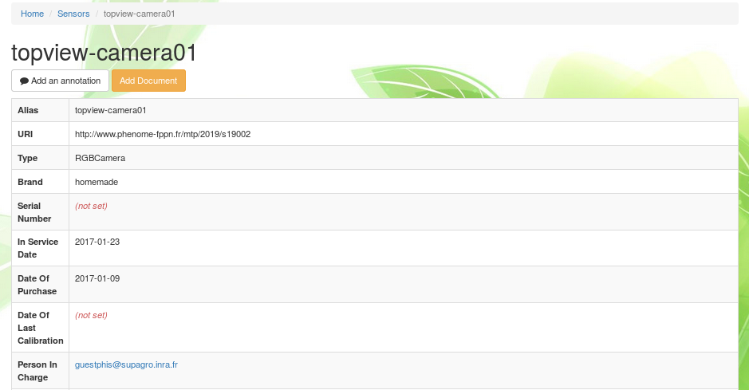

At the top of the sensor information sheet lies the <span class="btn btn-warning">Add document</span> button which remains orange until a first document has been added.
Documents linked to a sensor are typicaly a technical notice or an user manual.
See the [Documents](../phis-docs-community/experimental-organization/#documents) section for further information on documents and how to insert them in Phis.
The <span class="btn btn-default">Add annotation</span> button can be used by any user in order to annotate the selected sensor using the [Web Annotation Data Model](https://www.w3.org/TR/annotation-model/) (oa).
See the [Annotation](../phis-docs-community/experimental-organization/#annotation) section below for further information on annotations within Phis.

### Add sensors

Adding multiple sensors can be achieved by selecting the <span class="btn btn-success">Create Sensor</span> button at the top-left side of the `Sensors` menu.

The `Add Sensors` menu consists of an editable table in which each additionnal row should contain the information of an additionnal individual sensor to be entrered in Phis database.
The user interface has been built using Handsontable, a JavaScript spreadsheet that allow the user (i) to check quickly the data he is creating and (ii) to copy and paste entire tables into the `Add Sensors` menu.

The mandatory fields, in red, are:

- Alias
- Type
- Brand
- Person In Charge

However, it is highly recommended to fill every field, except the `Generated URI` field which is automatically produced by Phis after the user clicks on <span class="btn btn-success">Create Sensors</span>.

`Alias`. Internal name of the sensor (free text).

`Type`. Type of the sensor, chosen from a closed list.
Proposed sensor types are mainly greenhouse sensors : do not hesitate to contact OpenSILEX development team to add sensor types that cannot be found in the list in order to make it evolve.
If the dropdown list isn't displayed correctly, try selecting any element of the list : the column width will then expand automatically.

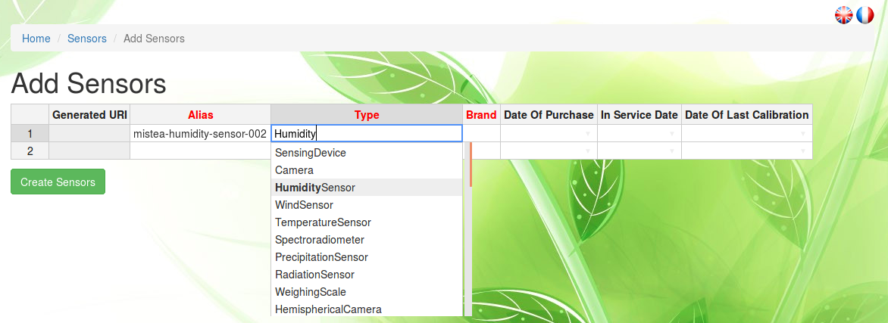

`Brand`. Brand of the sensor (free text).
"homemade" is a valid answer for sensors engineered/modified on site.

`Serial Number`. Free-text used to store the sensor serial number. Optionnal.

`Date of Purchase`. Date of the purchase (or creation for homemade sensors) of the sensor, provided in the YYYY-MM-DD (year-month-day) format. Optionnal.

`In Service Date`. Date provided in the YYYY-MM-DD (year-month-day) format of the first use of the sensor. Optionnal.

`Date of Last Calibration`. Date provided in the YYYY-MM-DD (year-month-day) format of the last calibration of the sensor. Optionnal.

`Person In Charge`. Username (email adress) of the person in charge of the sensing device (typically, the manager of the installation).
If the person in charge is not displayed in the dropdown list, you should first add it to the list of persons through the `Tools > Persons` menu. See the [Create a Person](../phis-docs-community/community/#create-a-person) section for details.

Not correctly filled fields appear in red.
As long as cells are displayed in red, no sensor can be created.

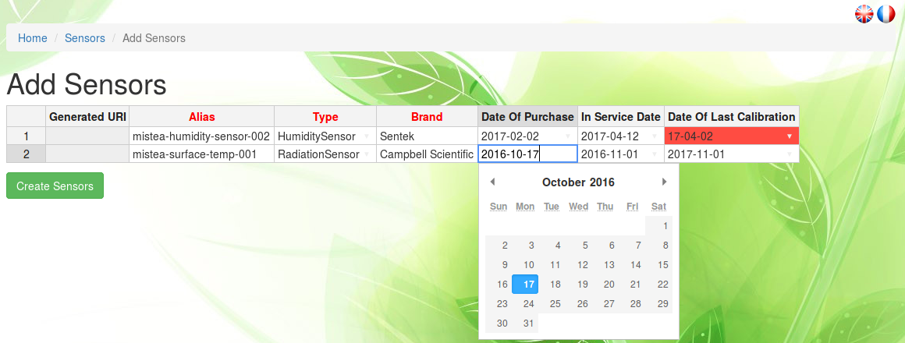

Note that when you add a single sensor only, you need to remove the second row displayed by default, using the `Remove row` button which appears after a right-click anywhere on the row to delete.
The number of rows has to match the number of added sensors.

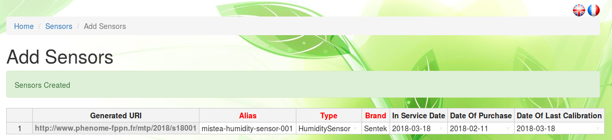

The `delete sensor` function has not been implemented yet : contact the OpenSILEX development team in order to ask for a sensor to be removed.

### Characterize sensors

Once sensors have been added to the information system, you can characterize them extensively by selecting the <span class="btn btn-success">Characterize Sensors</span> button at the top-left side of the `Sensors` menu.

Not all sensors can be characterized through the `Characterize sensors` menu, but only cameras (all camera types : RGB, multispectral, etc.), spectrometers and LiDAR.

The `Characterize Sensors` button leads to two sequential menus : in the first one you select the sensor (already integrated in the information system) you want to characterize, in the second one you characterize it.

One selects the sensor that need to be characterized providing two pieces of information :

- Type
- URI (will be changed to Alias in a future version of PHIS)

#### Cameras

Camera characteristics common to all cameras are :

`Height (pixels)`. Number of rows of pixels for the images.

`Width (pixels)`. Number of pixels in each row for the images.

`Pixel Size (µm)`. Pixel size for the images in µm.

The camera types "camera", "hemispherical camera" and "hyperspectral camera" require only those fields to be informed.

In the case of the types "RGB camera" and "TIR camera", additionnal `Lens` fields need to be informed :

`Label`. Internal name of the lens (free text).

`Brand`. Brand of the lens (free text).

`Person In Charge`. Username (email adress) of the person in charge of the sensing device (typically, the manager of the installation).
If the person in charge is not displayed in the dropdown list, you should first add it to the list of persons through the `Tools > Persons` menu. See the [Create a Person](../phis-docs-community/community/#create-a-person) section for details.

`In Service Date`. Date of the first use of the lens, provided in the format YYYY-MM-DD (year-month-day), directly or through the calendar view.

`Focal length (mm)`. Focal length associated to the spectral band.

`Aperture (f-number)`. Ratio of the camera lens' focal length to the diameter of the entrance pupil.

When it comes to multispectral cameras, in addition to the common "height", "width" and "pixel size" fields, one has to provide for each band of spectral discrimination information on :

`Wavelength (nm)`.

`Focal Length (mm)`.

`Attenuator Filter (%)`. Set up by the manufacturer of the camera. Between *0* and *100*. If the camera displays no attenuator filter, then set this value to *100*.

Up to 6 distinct bands of spectral discrimination can be informed in the form, each column matching a specific band and each row a different characteristic.
Not all column have to be filled up (if the camera captures 4 distinct bands, just inform the first 4 columns).

#### Spectrometers

When selecting the sensor type "Spectrometer", the following characteristics need to be filled up :

`Half Field Of View (°)`.

`Minimum Wavelength (nm)`.

`Maximum Wavelength (nm)`.

`Spectral Sampling Interval`.

#### LiDAR

When selecting a LiDAR, the following characteristics need to be filled up :

`Wavelength (nm)`.

`Scanning Angular Range (°)`.

`Scanning Angular Range (°)`.

`Scanning Angular Resolution (°)`.

`Spot width (°)`.

`Spot height (°)`.

### Link sensors to environmental variables

#### Purpose of the sensor-variable link

The link between a sensor and the data it produces can be established through Phis web client.
This link enables the visualization through graphics of the raw data produced by an environmental sensor directly from its information sheet.

This feature is for now dedicated only to environmental sensors measuring variations in the plant environment (e.g. humidity, temperature, radiation sensors...).
The output these sensors are environmental variables whose values can be displayed on the sensor information sheet they are linked to, if this link has been formally declared by a Phis user.

The link sensor-variable for phenotypic sensors such as cameras is not available, since most of those sensors do not provide directly intelligible data, but intermediate outputs such as images or other complex information which have to be treated before providing practical phenotypic variables such as plant heigh or chlorophyll content.

#### Creation of a the sensor-variable link

From the information sheet of an environmental sensor, one can associate it with variables already declared in the system through to the [Variables](../phis-docs-community/experimental-organization/#variables) menu.

A single environmental sensor can be linked to several variables previously declared in Phis.

From the `Sensors` menu (accessible from the **installation** menu in the top navigation bar), select a sensor from the sensors list clicking on the eye icon on the right to access its information sheet.
Then, go to the **Variables** field and add variables from the dropdown list displaying all the alias of the variables previously declared in Phis.

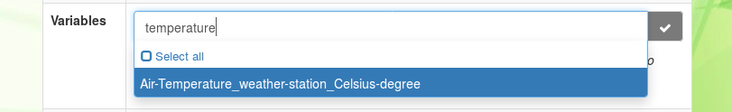

After having selected one or several variables, click on the *Update measured variable* button (check symbol) on the right to save the changes you made to the sensor.
You should get a green "Resources updated" pop-up on the top right corner of your screen after having clicked on the *Update measured variable* button.

The sensor-variable link is now saved in the triplestore and displayed in the **Variables** field of the sensor information sheet.
To remove this link, just click on the close window symbol ("x") next to the variable alias in the **Variables** field of the sensor, and then click on the *Update measured variable* button.
You should get another green "Resources updated" pop-up on the top right corner of your screen after having clicked on the *Update measured variable* button, which confirms the changes made.


If Phis contains data associated to the variables now linked to a given sensor, this data can be visualized from this sensor information sheet.
A graphic displaying the last recorded values of the variable (e.g. the last outputs from the sensor) is automatically produced in the **Sensor Data Visualization** section of the sensor information sheet.

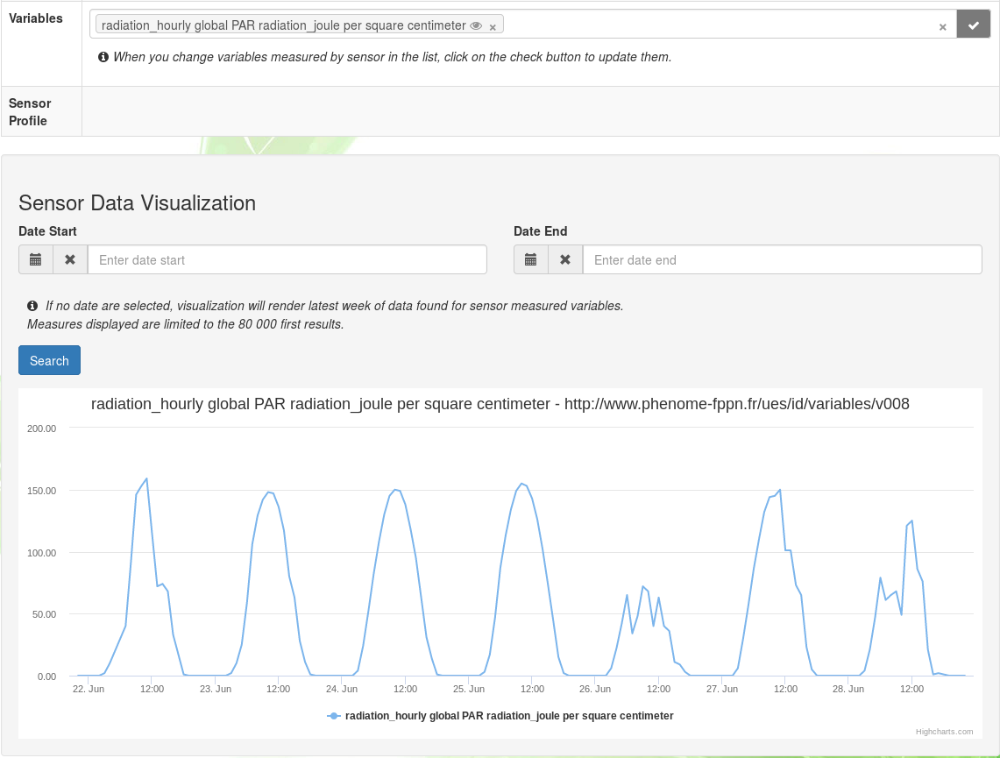

One can scroll through the data linked to a sensor using the **Date Start** and **Date End** values of the filter displayed on top of the graphic, and then clicking on the <span class="btn btn-primary">Search</span> button.

## Vectors

### Vectors properties

Sensors used for plant phenotyping can be carried on vectors such as UAVs or field robots.

The `Vectors` menu displays the list of vectors that have been declared by the user on Phis.
The vector list is preceded by a research bar enabling the user to filter registered vectors by their Alias, type, brand and optionnal attributes, such as the date of their purchase, the date of their first use or their serial number.

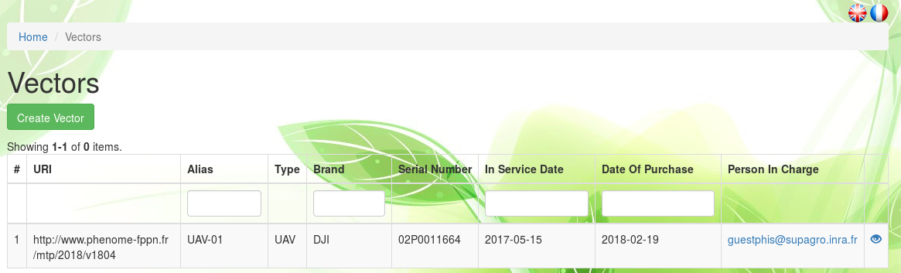

From **Home / Vectors**, one can click on the eye icon on the right of any listed vector to see its information sheet.

<!---

--->

At the top of the vector information sheet lies the <span class="btn btn-warning">Add document</span> button which remains orange until a first document has been added.
Documents linked  to a vector are typicaly a technical notice, an user manual or a brochure.
See the [Documents](../phis-docs-community/experimental-organization/#documents) section for further information on documents and how to insert them in Phis.
The <span class="btn btn-default">Add annotation</span> button can be used by any user in order to annotate the selected vector using the [Web Annotation Data Model](https://www.w3.org/TR/annotation-model/) (oa).
See the [Annotation](../phis-docs-community/experimental-organization/#annotation) section below for further information on annotations within Phis.

### Add vectors

Manually add multiple vectors can be achieved by selecting the <span class="btn btn-success">Create Vector</span> button at the top-left side of the `Vectors` menu.

The `Add Vectors` menu consists of an editable table in which each additionnal row should contain the information of an additionnal vectors to be inserted in Phis database.
The user interface has been built using Handsontable, a JavaScript spreadsheet that allow the user (i) to check quickly the data he is creating and (ii) to copy and paste entire tables into the `Add Vectors` menu.

The mandatory fields, in red, are:

- Alias
- Type
- Brand
- In Service Date
- Person In Charge

However, it is highly recommended to fill every field, expect the `Generated URI` field which is automatically produced by Phis after the user clicks on <span class="btn btn-success">Create Vectors</span>.

`Alias`. Internal name of the vector (free text).

`Type`. Type of the vector, chosen from a closed list.
There is only a handful of proposed vector types : do not hesitate to contact OpenSILEX development team to add vector types that cannot be found in the list in order to make it evolve.
If the dropdown list isn't displayed correctly, try selecting any element of the list : the column width will then expand automatically.

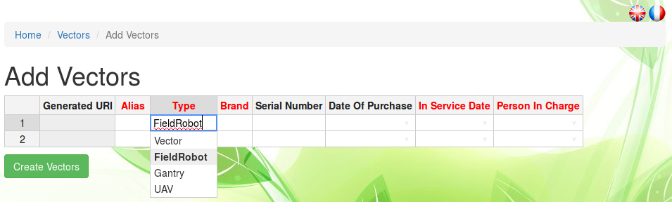

`Brand`. Brand of the vector (free text).
"homemade" is a valid answer for vectors engineered/modified on site.

`Serial Number`. Free-text used to store the vector serial number. Optionnal.

`Date of Purchase`. Date of the purchase (or creation for homemade vectors) of the vector, provided in the YYYY-MM-DD (year-month-day) format. Optionnal.

`In Service Date`. Date provided in the YYYY-MM-DD (year-month-day) format of the first use of the vector.

`Person In Charge`. Username (email adress) of the person in charge of the vector (typically, the manager of the installation).
If the person in charge is not displayed in the dropdown list, you should fisrt add it to the list of persons through the `Tools > Persons` menu. See the [Create a Person](../phis-docs-community/community/#create-a-person) section for details.

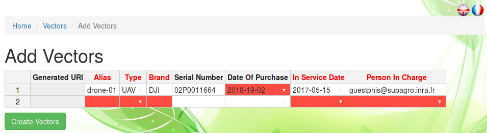

Not correctly filled fields appear in red.
As long as cells are displayed in red, no vector can be created.
Note that when you add a single vector only, you need to remove the second row displayed by default, using the `Remove row` button which appears after a right-click anywhere on the row to delete.
The number of rows has to match the number of added vectors.

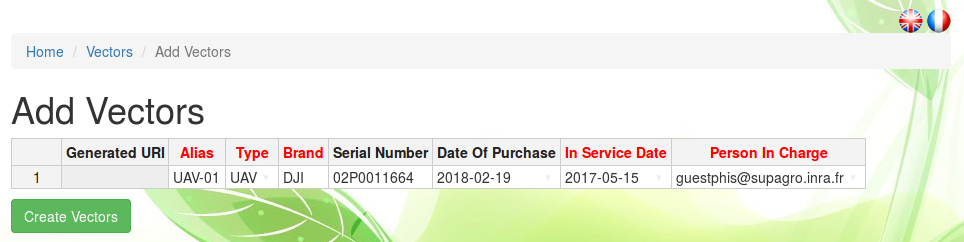

Complete the vector insertion in Phis clicking on the <span class="btn btn-success">Create Vectors</span> button.


Once created, the vector specifics can be modified with the <span class="btn btn-primary">Update</span> button located on top of any vector information sheet.

The `delete vector` function has not been implemented yet : contact the OpenSILEX development team in order to ask for a vector to be removed.

## Radiometric targets

### Radiometric targets properties

In order to record how phenotypic data has been produced, users can declare in the `Radiometric targets` menu the name and attributes of the radiometric targets enabling imagery softwares to calibrate and correct the reflectance of images originating from images acquisition sessions such as UAV flights.

The `Radiometric targets` menu displays the list of individual radiometric targets that have been declared by the user on Phis.
The radiometric target list is preceded by a research bar enabling the user to filter registered radiometric targets by their Alias and URI.

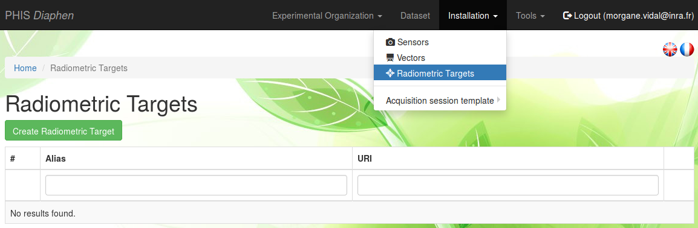

From **Home / Radiometric targets**, one can click on the eye icon on the right of any listed radiometric target to see its information sheet.


<!---
At the top of the radiometric target information sheet lies the <span class="btn btn-warning">Add document</span> button which remains orange until a first document has been added.
It is mandatory for radiometric targets to be linked to at least one document, a spectral hemispheric directional reflectance file.
See the [Documents](../phis-docs-community/experimental-organization/#documents) section below for further information on documents and how to insert them in Phis.
--->
The <span class="btn btn-default">Add annotation</span> button can be used by any user in order to annotate the selected radiometric target using the [Web Annotation Data Model](https://www.w3.org/TR/annotation-model/) (oa).
See the [Annotation](../phis-docs-community/experimental-organization/#annotation) section for further information on annotations within Phis.

### Add radiometric targets

The manual declaration of a single radiometric target can be achieved by selecting the <span class="btn btn-success">Create Radiometric Target</span> button at the top-left side of the `Radiometric Targets` menu.

The mandatory fields, followed by an asterisk, are:

- URI
- Alias
- Brand
- In Service Date
- Person In Charge

However, it is highly recommended to fill every field, except the `URI` field which is automatically generated by Phis after the user clicks on <span class="btn btn-success">Create</span>.

`Alias`. Internal name of the radiometric target (free text).

`Brand`. Brand of the radiometric target (free text).
"homemade" is a valid answer for radiometric targets engineered/modified on site.

`Serial Number`. Free-text used to store the radiometric target serial number. Optionnal.

`In Service Date`. Date provided in the YYYY-MM-DD (year-month-day) format of the first use of the radiometric target.

`Date of Purchase`. Date of the purchase (or creation for homemade targets) of the radiometric target, provided in the YYYY-MM-DD (year-month-day) format. Optionnal.

`Date of Last Calibration`. Date provided in the YYYY-MM-DD (year-month-day) format of the last calibration of the radiometric target. Optionnal.

`Person In Charge`. Username (email adress) of the person in charge of the radiometric target (typically, the manager of the installation).
If the person in charge is not displayed in the dropdown list, you should first add it to the list of persons through the `Tools > Persons` menu. See the [Create a Person](../phis-docs-community/community/#create-a-person) section for details.

`Material`. Material from which is made the part of the radiometric target exposed to the cameras during acquisition sessions. It can be "Carpet", "Painting" or "Spectralon" (dropdown list).
The material in the dropdown list have been proposed based on the ones used within the french plant phenotyping community : do not hesitate to contact OpenSILEX development team to add materials to this list.

`Shape`. Shape of the radiometric target, which can be either "Circular" or "Rectangular" (dropdown list).

`Length (m)` and `Width (m)` or `Diameter (m)`. Dimensions of the radiometric target. Either length & width or diameter are provided, depending on the shape that has been selected in the previous field.

`BRDF coefficient P1`, `P2`, `P3` and `P4`. Coefficients to the bidirectional reflectance distribution function (see the [BRDF wikipedia page](https://en.wikipedia.org/wiki/Bidirectional_reflectance_distribution_function) and the figure below), provided as real numbers (the decimal separator is `.` when using the English version, and `,` when using the French version of Phis).

<!---
$$
BRDF(\theta)=P_1+P_2cos(\theta)+\frac{1}{2}P_3(3\cos^2\theta-1)+\frac{1}{2}P_4(5\cos^3\theta-3\cos\theta)
$$
--->
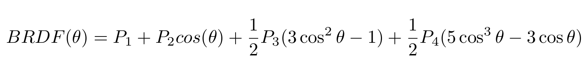

`Spectral hemispheric reflectance file`. CSV file showing the results of the radiometric target calibration.
The CSV file, using tabulations (`\t`) as field separators and dots (`.`) as decimal separators, displays in its first row the **wavelength (nm)** of the radiations to which the radiometric target has been exposed to, and in the second row the **reflectance percentage (%)** associated to each wavelength, provided in a range of [0 - 100].

```
450 560 710
15  18  21.2
```

Clink on on <span class="btn btn-success">Create</span> to complete the radiometric target registration in Phis.

Once created, the radiometric target metadata can be modified with the <span class="btn btn-primary">Update</span> button located on top of any radiometric target information sheet.
The `delete radiometric target` function has not been implemented yet : contact the OpenSILEX development team in order to ask for a radiometric target to be removed.

## Acquisition session template

The **Acquisition session template** in the `Installations` menu allows the user to download the template documents of the type `AcquisitionSessionUAVDocument` and `AcquisitionSessionPhenomobileDocument` that has previously been uploaded by the installation manager as documents from the [Infrastructures menu](../phis-docs-community/experimental-organization/#infrastructures).


The procedure followed by the installation manager to upload the templates to Phis is the following :

- go to the `Infrastructures` menu from the top navigation bar
- click on `Add document`
- fill the required fields (title, creator, language, creation date) related to the document you are uploading
- select the document type `AcquisitionSessionUAVDocument` (or `AcquisitionSessionPhenomobileDocument`)
- drag and drop or browse to select the XLSX document you want to upload as an acquisition session template for UAVs (or a field robot)
- click on the <span class="btn btn-success">Create</span> button

If more than one `AcquisitionSessionUAVDocument` (or `AcquisitionSessionPhenomobileDocument`) has been uploaded to Phis by the installation manager, only the ones with the latest `Creation date` can be downloaded through the **Acquisition session template** button.
