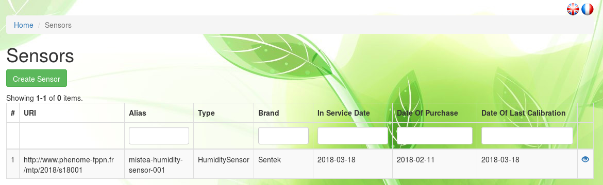

# Installation

## Sensors

### Sensors properties

In order to track where Phis data is coming from, users can declare in the `Sensors` menu the name and attributes of the sensing devices producing experiments' raw data.

The `Sensors` menu displays the list of individual sensors that have been declared by the user on Phis.
The sensor list is preceded by a research bar enabling the user to filter registered sensors by their URI, Alias, type, brand and optionnal attributes, such as the date of their purchase, the date of their first use the date of their last calibration.

From **Home / Sensors**, one can click on the eye icon on the right of any listed sensor to see its information sheet.

At the top of the sensor sheet lies the Add document button which remains orange until a first document has been added.
Documents linked  to a sensor are typicaly a technical notice or an user manual.
See the [Documents](../experimental-organization/#documents) section below for further information on documents and how to insert them in Phis.

### Add sensors

Manually add multiple sensors can be achieved by selecting the Create Sensor button at the top-left side of the `Sensors` menu.

The `Add Sensors` menu consists of an editable table in which each additionnal row should contain the information of an additionnal individual sensor to be entrered in Phis database.
The user interface has been built using Handsontable, a JavaScript spreadsheet that allow the user (i) to check quickly the data he is creating and (ii) to copy and paste entire tables into the `Add Sensors` menu.

The mandatory fields, in red, are:

- Alias
- Type
- Brand
- Person In Charge

However, it is highly recommended to fill every field, expect the `Generated URI` field which is automatically produced by Phis after the user clicks on Create Sensors.

`Alias`. Internal name of the sensor (free text).

`Type`. Type of the sensor, chosen from a closed list.
Proposed sensor types are mainly greenhouse sensors : don't hesitate to contact OpenSILEX development team to add sensor types that cannot be found in the list in order to make it evolve.
If the dropdown list isn't displayed correctly, try selecting any element of the list : the column width will then expand automatically.

`Brand`. Brand of the sensor (free text).
"homemade" is a valid answer for sensors engineered/modified on site.

`Serial Number`. Free-text used to store the sensor serial number. Optionnal.

`Date of Purchase`. Date of the purchase (or creation for homemade sensors) of the sensor, provided in the YYYY-MM-DD (year-month-day) format. Optionnal.

`In Service Date`. Date provided in the YYYY-MM-DD (year-month-day) format of the first use of the sensor. Optionnal.

`Date of Last Calibration`. Date provided in the YYYY-MM-DD (year-month-day) format of the last calibration of the sensor. Optionnal.

`Person In Charge`. Username (email adress) of the person in charge of the sensing device (typically, the manager of the installation).
If the person in charge is not displayed in the dropdown list, you should fisrt add it to the list of persons through the `Tools > Persons` menu. See the [Create a Person](../community/#create-a-person) section for details.

Not correctly filled fields appear in red.
As long as cells are displayed in red, no sensor can be created.

Note that when you add a single sensor only, you need to remove the second row displayed by default, using the `Remove row` button which appears after a right-click anywhere on the row to delete.
The number of rows has to match the number of added sensors.

The `delete sensor` function has not been implemented yet : contact the OpenSILEX development team in order to ask for a sensor to be removed.

### Characterize sensors

Once sensors have been added to the information system, you can characterize them extensively by selecting the Characterize Sensors button at the top-left side of the `Sensors` menu.

The `Characterize Sensors` button leads to two sequential menus : in the first one you select the sensor (already integrated in the information system) you want to characterize, in the second one you characterize it.

One selects the sensor to characterize using its type and its URI (or Alias) :

- Type
- URI

Not all sensors can be characterized through the `Characterize sensors` menu, but only cameras (all camera types : RGB, multispectral, etc.), spectrometers and LiDAR.

#### Cameras

#### Spectrometers

#### LiDAR

## Vectors

### Vectors properties

Sensors used for plant phenotyping can be carried on vectors such as UAVs or field robots.

The `Vectors` menu displays the list of vectors that have been declared by the user on Phis.
The vector list is preceded by a research bar enabling the user to filter registered vectors by their Alias, type, brand and optionnal attributes, such as the date of their purchase, the date of their first use or their serial number.

### Add vectors

Manually add multiple vectors can be achieved by selecting the Create Vector button at the top-left side of the `Vectors` menu.

The `Add Vectors` menu consists of an editable table in which each additionnal row should contain the information of an additionnal vectors to be inserted in Phis database.
The user interface has been built using Handsontable, a JavaScript spreadsheet that allow the user (i) to check quickly the data he is creating and (ii) to copy and paste entire tables into the `Add Vectors` menu.

The mandatory fields, in red, are:

- Alias
- Type
- Brand
- In Service Date
- Person In Charge

However, it is highly recommended to fill every field, expect the `Generated URI` field which is automatically produced by Phis after the user clicks on Create Vectors.

`Alias`. Internal name of the vector (free text).

`Type`. Type of the vector, chosen from a closed list.
There is onmly a handful of proposed vector types : don't hesitate to contact OpenSILEX development team to add vector types that cannot be found in the list in order to make it evolve.
If the dropdown list isn't displayed correctly, try selecting any element of the list : the column width will then expand automatically.

`Brand`. Brand of the vector (free text).
"homemade" is a valid answer for vectors engineered/modified on site.

`Serial Number`. Free-text used to store the vector serial number. Optionnal.

`Date of Purchase`. Date of the purchase (or creation for homemade vectors) of the vector, provided in the YYYY-MM-DD (year-month-day) format. Optionnal.

`In Service Date`. Date provided in the YYYY-MM-DD (year-month-day) format of the first use of the vector.

`Person In Charge`. Username (email adress) of the person in charge of the vector (typically, the manager of the installation).
If the person in charge is not displayed in the dropdown list, you should fisrt add it to the list of persons through the `Tools > Persons` menu. See the [Create a Person](../community/#create-a-person) section for details.

Not correctly filled fields appear in red.
As long as cells are displayed in red, no vector can be created.
Note that when you add a single vector only, you need to remove the second row displayed by default, using the `Remove row` button which appears after a right-click anywhere on the row to delete.
The number of rows has to match the number of added vectors.

Complete the vector insertion in Phis clicking on the Create Vectors button.

Once created, the vector specifics can be modified with the Update button located on top of any vector information sheet.

The `delete vector` function has not been implemented yet : contact the OpenSILEX development team in order to ask for a vector to be removed.
